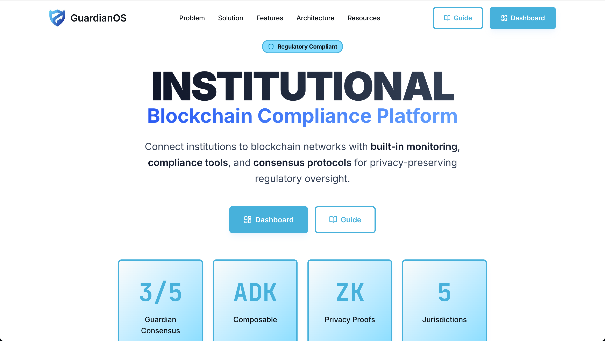

# GuardianOS

Multi-agent compliance monitoring dashboard for privacy-preserving blockchain payments. Frontend for the Google ADK Hackathon submission.

## Related Repositories

- **PrivacyGuard Backend**: [guardianos-adk/adk](https://github.com/guardianos-adk/adk) - ADK agent orchestration
- **Fraud Monitoring**: [guardianos-adk/monitor](https://github.com/guardianos-adk/monitor) - ML fraud detection service
- **Smart Contracts**: [guardianos-adk/contracts](https://github.com/guardianos-adk/contracts) - Solidity contracts on Sepolia

## Live Deployment

- **Main API**: https://guardianos-api-753766936932.us-central1.run.app
- **Fraud API**: https://fraud-sentinel-api-753766936932.us-central1.run.app

## System Overview

GuardianOS implements selective disclosure for blockchain transactions using Google ADK agents:

- **Low Risk (<0.4)**: Auto-approved
- **Medium Risk (0.4-0.7)**: 5-agent workflow
- **High Risk (>0.7 or >€75k)**: 10-agent Tenth Opinion Protocol

## Key Features

### 1. Multi-Agent Compliance System

The backend uses 14+ AI agents coordinated by Google ADK:

**Standard 5-Agent Workflow:**
- TransactionMonitor - Blockchain event monitoring
- RiskAssessment - ML-based risk scoring  
- GuardianCouncil - 3-of-5 threshold voting
- PrivacyRevoker - Selective de-anonymization
- ComplianceLogger - Audit trail recording

**Tenth Opinion Protocol (10 agents):**
- Phase 1: Blind Analysis (4 agents, parallel)
- Phase 2: Informed Cross-Analysis (3 agents, sequential)
- Phase 3: Quality Assurance (2 agents, parallel)
- Phase 4: Final Synthesis (1 agent)

### 2. Dashboard Pages

- `/` - System overview and metrics
- `/guardian-council` - Live voting status
- `/agents` - AI agent performance monitoring
- `/compliance` - Regulatory compliance tracking
- `/transactions` - Transaction analysis
- `/tenth-opinion` - High-stakes decision protocol
- `/fraud-monitoring` - Real-time fraud alerts
- `/blockchain` - Smart contract interactions

### 3. Real-time Updates

- WebSocket connections for live agent updates
- Auto-refresh every 30-60 seconds
- Connection status indicators
- Toast notifications for errors

## Tech Stack

- **Framework**: Next.js 15.3.3 with App Router
- **Language**: TypeScript
- **Styling**: Tailwind CSS + shadcn/ui
- **Blockchain**: Wagmi + Viem
- **Real-time**: Socket.IO
- **Package Manager**: Bun

## Setup

1. **Clone and install:**
```bash
git clone https://github.com/guardianos-adk/nextjs.git
cd nextjs
bun install
```

2. **Configure environment:**
```bash
cp .env.example .env.local
# Edit .env.local with your API endpoints
```

3. **Run development:**
```bash
bun dev
```

## Environment Variables

```env
# API Endpoints
NEXT_PUBLIC_API_BASE_URL=https://guardianos-api-753766936932.us-central1.run.app
NEXT_PUBLIC_WEBSOCKET_URL=https://guardianos-api-753766936932.us-central1.run.app
NEXT_PUBLIC_FRAUD_API_URL=https://fraud-sentinel-api-753766936932.us-central1.run.app

# Blockchain
NEXT_PUBLIC_WALLETCONNECT_PROJECT_ID=your_project_id
NEXT_PUBLIC_ALCHEMY_API_KEY=your_alchemy_key
```

## Smart Contract Integration

Deployed on Sepolia testnet:
- SeDeFramework: `0x4fc7714aAC94a83D829CE4Cd30f68075b594e11B`
- FraudSentinel: `0xFf0f28F105AB1df22667a4beE6f26b09c42680aa`
- PrivacyPool: `0x392469a668399A3c95293125D95588A1Bc8c8078`

## Testing

```bash
bun test
bun lint
bun type-check
```

## Deployment

### Vercel (Recommended)
```bash
vercel
```

### Docker
```bash
docker build -t guardianos-frontend .
docker run -p 3000:3000 guardianos-frontend
```

## Performance Metrics

- Transaction processing: ~3.26s average
- Low-risk auto-approval: <2s
- Tenth Opinion Protocol: ~4.2s
- WebSocket latency: <100ms

## License

MIT